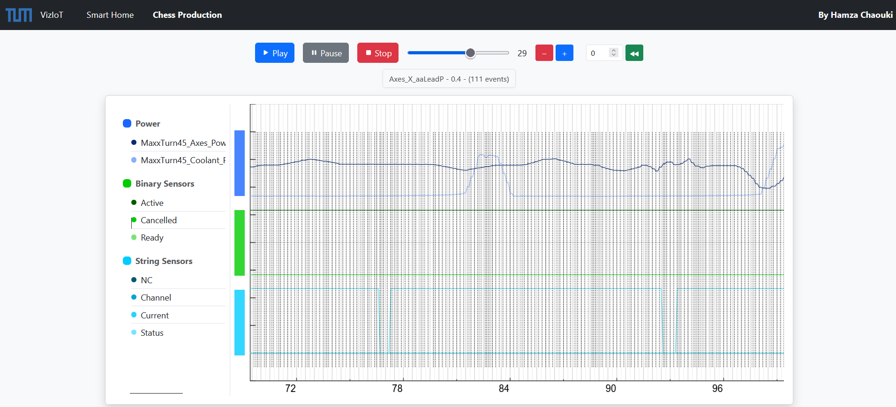

# VizIoT

**VizIoT** is an interactive web-based application designed to visualize Internet of Things (IoT) sensor event streams, enabling experts and researchers to explore, monitor, and analyze IoT-driven processes with enhanced process awareness.



## Overview

The rapid proliferation of IoT technologies has resulted in an abundance of sensor data, which is often complex and challenging to interpret. **VizIoT** addresses this challenge by providing an intuitive user interface (UI) for visualizing process event data from IoT environments.

The application bridges the gap between raw IoT sensor data and process events, making it easier to identify key events, observe trends, and gain actionable insights into process workflows.

## Research Context

**VizIoT** is developed as part of a bachelor’s thesis titled "Exploring IoT Process Events through Interactive Visualization" at the Technical University of Munich, under the Chair of Information Systems and Business Process Management. The thesis builds upon the framework proposed by [Mangler et al. (2024)](https://arxiv.org/abs/2405.08528) , which addresses the lack of "process awareness" in IoT sensor data.

### Motivation

We want to mine process events from sensor streams.
We assume that value changes that occur together in many parallel running sensor streams signify important process events in these sensor streams.

Therefore, a file format was created that contains for certain timestamps, which sensors changed together.

As said before, timestamps with many sensors contributing to a change are deemed more important.

For this thesis, we created a visualization tool in the spirit of Celonis (we have a slider!) that shows you the sensor values that are most important (i.e., the ones that most probably signify process events with their changes), where we can gradually unhide less important sensor values (with the slider!) to explore the timeline.

Our tool also allows to mark and annotate timestamps/events/sensors to save our thoughts and findings.

Our tool is supposed to be used by experts who know the meaning of the sensors and the changes together. It is supposed to make their life easier by hiding parts of complex sensor streams and to allow them to concentrate on the important parts.


### Methodology

The thesis adopts the Design Science Research Methodology (DSRM), focusing on the development of a practical and innovative artifact to address real-world challenges. **VizIoT** embodies this artifact, providing an intuitive and efficient interface for exploring IoT data and empowering users to gain actionable insights.

### Research Questions Addressed:

1. What are the current best practices and methodologies in IoT event data visualization?
2. How can process events be efficiently visualized in a structured IoT sensor data stream to facilitate process monitoring and analysis?
3. How can the effectiveness of the application be evaluated in detecting significant events within IoT sensor data streams?

## Key Features

- **Interactive Real-time Visualization**: Displays the flow of events in an IoT process, with dynamic updating of sensor data streams and automatic sliding window.
- **Event Annotation System**: Add, view, and manage annotations for significant events to document insights and observations.
- **Importance Marking**: Flag important events for prioritized attention and easier future reference.
- **Sensor Selection and Filtering**: Control the number of sensors shown in the visualization to focus on relevant data.
- **Playback Controls**: Play, pause, and rewind functionality for reviewing past data.
- **Color-coded Groups**: Automatically organized and color-coded sensor groupings for better visual organization.
- **Responsive UI**: Built with Bootstrap for a clean, responsive interface across different devices.

## Technology Stack

- **Backend**: Node.js with Express.js
- **Database**: SQLite
- **Frontend**: Vanilla JavaScript with Bootstrap as UI library
- **Visualization Framework**: GR Framework ([https://gr-framework.org](https://gr-framework.org))

## Project Structure

The application follows a modular architecture:

### Backend
- `backend/database/`: Database management and query operations
  - `db.js`: Core database setup and connection handling
  - `dataFetching.js`: Functions to retrieve sensor and event data
  - `dataStorage.js`: Functions to store and process incoming data
  - `queries/`: SQL query definitions organized by entity type
- `backend/server/`: Express.js server implementation
  - `server.js`: Main server entry point
  - `streamHandler.js`: Server-Sent Events (SSE) implementation for streaming
  - `routes/`: API route definitions
  - `logs/`: Contains sample data files for the application

### Frontend
- `frontend/`: Client-side code
  - `index.html`: Main application page
  - `public/`: Static assets like images and icons
  - `source/`: Application source code
    - `css/`: Styling for the application
    - `js/`: JavaScript modules
      - `app.js`: Application initialization
      - `state.js`: Application state management
      - `utils.js`: Utility functions
      - `components/`: UI components (modals, annotations, tabs)
      - `graph/`: Visualization components
        - `graph.js`: Main graph management
        - `buffer.js`: Data buffer handling
        - `components/`: Graph subcomponents
      - `streaming/`: Data stream handling

### Data
- `data/`: SQLite database files
  - `evaluation.db`: Smart Home dataset
  - `sensor_logs.db`: Chess Production dataset

## User Guide

### Visualization Controls

- **Play/Pause Button**: Start or pause the data stream visualization
- **Stop Button**: Stop the current visualization session
- **Sensor Slider**: Adjust the number of sensors displayed (1 to maximum available)
- **Rewind**: Go back in time by specifying seconds in the input field

### Interaction

- **Event Lines**: Vertical lines on the graph represent events. Solid yellow lines indicate important events
- **Clicking on Events**: Click on any event line to view details and add annotations
- **Clicking on Sensor Lines**: Click on sensor lines to view detailed readings and values
- **Legend**: Interactive color-coded legend for identifying different sensor groups
- **Heatmap**: Visual representation of group intervals


## Prerequisites
- Node.js (v14.0 or higher)
- npm (v6.0 or higher)

1. Clone the repository:  

   ```bash
   git clone https://github.com/HamzaChkx/VizIoT.git
   ```
2. Navigate to the project directory:

    ```bash
    cd VizIoT
    ```
3. Install Dependencies

    ```bash
    npm install
     ```

4. Run the application

    ```bash
    npm start
    ```

## Acknowledgements

- [Technical University of Munich](https://www.cs.cit.tum.de/bpm/chair/) - Chair of Information Systems and Business Process Management
- [Chess Piece Dataset](https://zenodo.org/records/7958478) - Dataset used for building the solution
- [GR Framework](https://gr-framework.org) - Used for graph visualization
- [Bootstrap](https://getbootstrap.com/) - Used for UI components
- [SQLite](https://www.sqlite.org/index.html) - Database engine